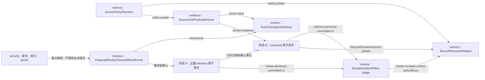

# HDM-004｜正式 Schema、事务与 Outbox 只读分析报告

`分析状态：HDM004_ANALYSIS_READY_FOR_HIDE_REVIEW`

`性质：只读施工分析；不是迁移、实现或实施授权`

`计数口径：42 个正式持久化槽位（39 个契约明确表名＋3 个契约必需但物理表名未定的槽位）／4 个物理 namespace：evidence、memory、runtime、security。`

| 汇总门 | 结果 |
|---|---|
| 正式表槽位／schema | 42／4 |
| 事务卡／全局锁顺序 | 7／PASS |
| 状态机／跨对象迁移 | 5／23 |
| 权威冲突／阻塞 HDM-004 验收的未决／已路由事项 | 0／0／17 |
| Outbox STALE／DENIED | `SUCCEEDED`＋消费者/run 无正文结果记录 |
| PT-04 gap 关闭归属 | 2／2 |
| HDM-005／006 边界 | PASS |

## 1. 基线与证据清单

### 1.1 Git 与开发链基线

| 项目 | 证据 | 判定 |
|---|---|---|
| 仓库／分支 | `D:\myproject\hide-nest`；`git branch --show-current` → `main` | 【代码已证实】 |
| 当前 HEAD | `git rev-parse HEAD` → `a282f35eba767be4e11ed163dd58a07b9d79beaa` | 【代码已证实】与工单基线一致 |
| 工作树／index | R1 开始时 `git status --porcelain=v1 -uall` 仅显示 `?? reports/HDM-004-分析报告.md`；`git diff --`、`git diff --cached` 均无输出 | 【代码已证实】tracked 0／staged 0，唯一 untracked 为本报告 |
| 001→002→003 | `7fc98dbde579...`（无父提交，HDM-001 设计基线）→ `cedf8a47bc71...`（parent=`7fc98db...`，HDM-002）→ `a282f35eba76...`（parent=`cedf8a4...`，HDM-003） | 【代码已证实】不得把 HDM-001 manifest 的旧 HEAD 当当前 HEAD |
| 正式数据库现状 | `git ls-files` 对 `db/database/migration/flyway/jooq/*.sql` 搜索零命中；仓库全文搜索无 Flyway、jOOQ、JDBC、DataSource、pgvector 或正式 outbox 实现 | 【代码已证实】尚无正式 schema／迁移／数据库测试入口 |

【配置已证实】根 `pom.xml:25-33` 只有 `evidence/memory/runtime/security/contracts/architecture-tests/api/worker` 模块；`pom.xml:36-51` 只有 Spotless。四个领域模块 POM 均只有父 POM 与 artifact 元数据。当前没有数据库依赖、Flyway plugin、jOOQ plugin 或数据库 profile。

【配置已证实】`scripts/verify.ps1:42-70` 会执行 Maven clean、npm ci、生成与完整验证；`scripts/generate.ps1:166-218` 会创建或改写 `target`／生成树。因此本轮按只读边界没有运行这些命令。

### 1.2 权威证据索引

后文 `E01` 等短号均指向本表的完整路径与章节／行号，不代表降低权威层级。

| ID | 路径与定位 | SHA-256／作用 |
|---|---|---|
| E01 | `C:\Users\tangx\Documents\hide-talk\hide记忆系统_需求基线_manifest_v0.1.md:1-65` | `857E4C...8157`；冻结规则。其引用的实际基线文件大小 `47568`、SHA-256 `B53D71...D3B5` 已用 `Get-FileHash` 重算并吻合【正式契约】 |
| E02 | `C:\Users\tangx\Documents\hide-talk\hide记忆系统_正式开发详细契约_v0.1.md:11-266,360-486,512-555` | `55428B...B580`；字段级 schema、事务、outbox、failure code、能力与验收【正式契约】 |
| E03 | `C:\Users\tangx\Documents\hide-talk\hide记忆系统_规范记忆对象_v0.1.md:31-363,413-547` | `D1D83C...2D95`；四平面、规范对象、保留与禁止退化【正式契约】 |
| E04 | `C:\Users\tangx\Documents\hide-talk\hide记忆系统_生命周期迁移矩阵_v0.1.md:11-229` | `9C74E2...0561`；五组状态机、23 个跨对象迁移与失败语义【正式契约】 |
| E05 | `C:\Users\tangx\Documents\hide-talk\hide记忆系统_技术架构决定记录_ADR_v0.1.md:51-84,104-120` | `9439F2...ED6`；TADR-003/004/006【正式契约】 |
| E06 | `C:\Users\tangx\Documents\hide-talk\260731-hide协作文件夹\DevelopmentBaselineManifest-HDM-001-v0.1.json:14-99,125-166` | `2AFF24...73D5`；模块、四 schema、命令与保护区【配置已证实】 |
| E07 | `C:\Users\tangx\Documents\hide-talk\hide记忆系统_正式开发任务_v0.1\HDM-004-schema事务与outbox-分析.md:1-47` | `358CE2...A96F`；原任务边界【正式契约】 |
| E08 | `D:\myproject\hide-nest\contracts\events\pink-event-v1.schema.json:8-129` | 当前事件信封、12 个 event type、正文禁入字段【代码已证实】 |
| E09 | `D:\myproject\hide-nest\contracts\openapi\problem-detail.schema.json:45-105`；`contracts/openapi/hide-nest-api.yaml:188-314` | 六种 result category、Memory 状态仅两值、50 个 failure code【代码已证实】 |
| E10 | `D:\myproject\hide-nest\contracts\inventory\ContractInventory-HDM-003-v0.1.json:2490-2638` | 50 failure code；逐 code retryable/HTTP 映射仍为非权威延期项【代码已证实】 |
| E11 | `C:\Users\tangx\Documents\hide-talk\hide记忆系统_正式开发任务_v0.1\HDM-005-规范数据库与事务模式-核心.md:14-33` | 核心参考实现边界【正式契约】 |
| E12 | 同目录 `HDM-006-持久化jOOQ与outbox扩展-实施.md:15-42` | 机械扩展边界【正式契约】 |
| E13 | 同目录 HDM-007/008、011、014、017/018、020 各任务全文 | 身份、closeout、检索、治理、恢复、PayloadStore 延期接口【正式契约】 |
| E14 | `C:\Users\tangx\Documents\hide-talk\260731-hide协作文件夹\Task16A-A-HDM-004物理命名空间与Decision发布拓扑裁定.md:1-125` | SHA-256 `C804351F...7590`；C-01/C-02、outbox 结果语义与 17 项责任路由的 hide 裁定【正式契约】 |

### 1.3 原型证据（不得升级为正式设计）

| ID | 原型证据 | 可用结论／不可用边界 |
|---|---|---|
| P01 | `...\pt-01\schema.sql:6-229`；`run.mjs`／`run-replay.mjs` 的 PT01-01—08 | 【原型证据】演示行锁、批回滚、幂等重放、policy 竞态；但单 `pink` schema、`text` ID、`ISOLATED/DELETED`、Proposal 状态均违反正式契约，不可复制。 |
| P04 | `...\pt-04\schema.sql:6-190`；`run-replay.mjs:24-34,183-330` | 【原型证据】演示 `SKIP LOCKED`、lease 过期、效果键、policy stale、终败通知；但 `DELETE_PENDING/DELETED`、`DEAD/CANCELLED`、`max_attempts=3` 都不是正式 outbox/schema。 |

【原型证据】PT-04 的两个已知 gap 原样保留，未写成已解决：

1. `schema_gap_outbox_not_enforced_for_all_aggregate_writes`；关闭责任：HDM-005 建立数据库可核验关联与唯一规范事务入口，HDM-006 扩展所有写路径并做反证。
2. `schema_gap_failure_code_not_enumerated`；关闭责任：HDM-005 将数据库 failure code 边界与 E09 的 50 值对齐，HDM-006 将所有 outbox/run 写入纳入 FK／版本化约束与测试；不得采用 PT-04 自由文本。

## 2. 权威裁定、审计说明与责任路由

### 2.1 C-01／C-02 解阻审计

| ID | R1 状态 | hide 裁定与报告落点 |
|---|---|---|
| C-01 | `RESOLVED_PHYSICAL_SCHEMAS` | 【正式契约】E14 §2 固定唯一物理 schema 为 `evidence/memory/runtime/security`。Task16A 原工单把 semantic/governance 逻辑平面误写成物理 namespace；本报告保留这条发令方纠错审计，不再把它列为冲突。AccessPolicy、Decision、Review、治理围栏归 memory；身份与动作能力归 security。 |
| C-02 | `RESOLVED_TWO_ATOMIC_STAGES` | 【正式契约】E14 §3 固定 closeout 为两个各自原子的阶段：阶段 A 全量 Decision 全成或全不成；阶段 B 只锁定、引用并验证既有确认 Decision，绝不重建或改写。canonical 失败保留“已确认待执行”，沿原 Decision 与原幂等身份重试。 |

【正式契约】两个完成事实事件不得合并：`review.decisions-committed.v1` 只表示阶段 A，`memory.canonical-committed.v1` 只表示阶段 B。用户可见的 `DECISIONS_COMMITTED`（已确认、尚未保存）、`CANONICAL_COMMITTED`（已完整保存）、`INDEX_READY`（派生检索已追上）三个阶段也不得合并。

R1 裁定后：权威冲突 `0`；阻塞 HDM-004 验收的未决 `0`。

### 2.2 已路由实施／延期事项（17）

以下事项都保留为后续工作或初始版本事实，未写成已经实施；每个编号只出现于一条责任路由。

| ID | 事项 | 裁定分类与唯一责任路由 |
|---|---|---|
| B-01 | 每条 FK 的显式 `ON DELETE` | HDM-005 数据库设计门；逐项裁定并反证，不阻塞 HDM-004。 |
| B-02 | 部分 SQL 类型、长度、nullability、collation | HDM-005 数据库设计门；缺值不得猜。 |
| B-03 | 最终版 Decision 唯一键与确认→canonical 唯一键 | HDM-005 数据库设计门；提供并发反证。 |
| B-04 | AccessPolicy current owner/cardinality、grant 字典与 scope | HDM-005 数据库设计门。 |
| B-05 | deletion closure member 的精确列、成员类型与版本键 | 明确延期接缝；HDM-005 只留最小接口，HDM-017/018 定义删除语义。 |
| B-06 | credential/capability/security epoch 的完整列、表名与 FK | 明确延期接缝；HDM-007 分析、HDM-008 核心实现。 |
| B-07 | consumer effect ledger 的正式名、结果列、保留与下游协议 | HDM-005 定参考模式，HDM-006 机械扩展。 |
| B-08 | 不可变表的 privilege/trigger/repository 组合 | HDM-005 数据库设计门；必须数据库反证。 |
| B-09 | aggregate write 与 outbox 的数据库关联键 | HDM-005 数据库设计门；关闭 PT-04 all-write gap。 |
| B-10 | failure code 的 code table/版本化 CHECK 与契约漂移门 | HDM-005 数据库设计门；只固化 E09 的 50 值。 |
| B-11 | FTS/vector 投影、距离函数、opclass 与索引参数 | 明确延期接缝；HDM-014/015。 |
| B-12 | Flyway、jOOQ、数据库集成测试命令入口 | HDM-005 数据库设计门；在实施工单发布正式入口。 |
| B-13 | 当前没有旧正式数据库版本 | 初始版本事实；不阻塞空库基线，升级验证从后续 V1→V2 开始。 |
| B-14 | lease/backoff/jitter/clock-skew 参数 | HDM-005 定模式，HDM-006 参数化并扩展测试。 |
| B-15 | SourcePayload 共享引用、TTL 与物理删除所有权 | 明确延期接缝；HDM-017/018/019/020。 |
| B-16 | policy/fence 复核与外部副作用之间的 fencing | 明确延期接缝；HDM-007/014/017 审查，HDM-005 只留最小 port。 |
| B-17 | 安全抑制的 outbox 收口语义 | E14 §4 已解决：不新增 state；零副作用后 outbox=`SUCCEEDED`，消费者/run 记录无正文 `STALE` 或 `DENIED`；真正不可恢复或第 8 次耗尽才 `FINAL_FAILED`。 |

## 3. 四 schema 表／约束矩阵

### 3.1 namespace 与计数口径

【正式契约】E14 §2 已固定四个物理 namespace 为 `evidence/memory/runtime/security`。E03 的 semantic/governance 仅为逻辑平面，二者共同落在 `memory`；身份、入口与动作能力落在 `security`。下表按这个唯一物理归属展示。

全局列规则来自 E02:19-41：ID 为应用生成 UUIDv7、数据库 `uuid`；业务时间 UTC `timestamptz`；严格事件顺序另用 identity `bigint`；外部枚举采用 code table 或版本化约束而非 PostgreSQL enum；所有表至少 `created_at`，可变运行表另有 `updated_at`。未由契约给出的字段均写“未定”，不是默认值。

本节每一行的对象／字段事实均标作【正式契约】并由该行 E02/E03/E04 定位支撑；每一处数据库补全均显式写【建议】或【无法验证】。权威输入没有要求任何 exclusion constraint；因此【无法验证】不能凭空增加 exclusion constraint，HDM-005 只能在发现有权威的重叠区间/资源互斥语义后再提请 hide 审查。

### 3.2 evidence（5）

| 表／对象来源 | PK／稳定标识；必填核心 | FK／删除；唯一／检查 | 不可变／更新白名单；JSONB／载荷；索引；波次 |
|---|---|---|---|
| `evidence.source`；Source（E02:62-73；E03:76-94） | `source_id uuid`; kind/platform/external_ref/观察位/policy/created/ingested | policy→AccessPolicy；`UNIQUE(platform,external_ref)`；【建议】FK NO ACTION | 可更新仅观察值，精确白名单未定；无 JSONB/凭据；【建议】policy、ingested 索引；W3 |
| `evidence.source_unit`；SourceUnit（E02:75-88；E03:96-116） | `source_unit_id`; source/external_unit_ref/source_version/ordinal/created | source→source，actor→actor_ref；`UNIQUE(source_id,external_unit_ref,source_version)`；NO ACTION【建议】 | 坐标不可改；正文禁止入行；【建议】`(source_id,ordinal)`；W3 |
| `evidence.source_payload`；SourcePayload（E02:90-106；E04:115） | `payload_id`; unit/kind/store/object_ref/content_type/size/hash/policy+rev/retention/created | unit→source_unit，policy→AccessPolicy；size/expiry 检查精确值未定；NO ACTION【建议】 | 载荷在 PayloadStore，行仅元数据；秘密/签名 URL 禁入；policy/TTL 可更新白名单未定；【建议】unit、policy、`expires_at WHERE not null`；W3 |
| `evidence.source_anchor`；SourceAnchor（E02:108-113；E03:118-131） | `anchor_id`; source/anchor_kind/created | source→source；NO ACTION【建议】 | 不复制原文、不存 payload 删除状态；不可变【建议】；source 索引；W3 |
| `evidence.source_anchor_unit`；Anchor↔Unit | PK `(anchor_id,ordinal)`；unit/offsets/ordinal | anchor→anchor，unit→source_unit；完整消息边界检查无法仅凭现字段验证；NO ACTION【建议】 | 不可变；无 JSONB；unit 反查索引；W3 |

### 3.3 memory：semantic 逻辑平面（4）

| 表／对象来源 | PK／稳定标识；必填核心 | FK／删除；唯一／检查 | 不可变／更新白名单；JSONB／载荷；索引；波次 |
|---|---|---|---|
| `memory.actor_ref`；ActorRef（E02:117-120；E03:57-72） | `actor_id`; actor_kind/stable_ref/created | 无正式上游 FK；stable_ref 唯一范围未定 | 只保存最小引用，不扩张画像；display_label 是否可改未定；【建议】kind/ref lookup；W2 |
| `memory.memory_record`；MemoryRecord（E02:121-131；E04:74-83） | `memory_id`; state/current_revision/policy+rev/created/updated | current→自身 revision（循环、提交时检查）；policy→AccessPolicy；current 唯一；state 仅 ACTIVE/ARCHIVED；所有 FK NO ACTION【建议】 | 白名单仅 state/current/policy pointers/updated；隔离、DELETE_PENDING、DELETED 禁止；【建议】state/policy、ACTIVE partial；W3 表、W4 pointer |
| `memory.memory_revision`；MemoryRevision（E02:133-139；E03:147-172） | `memory_revision_id`; memory/revision_no/type/body/decision/created | memory→record、actor→actor_ref、decision→decision；`UNIQUE(memory_id,revision_no)`；type 六值；NO ACTION【建议】 | 行不可变；body 允许在规范表但禁止日志/outbox；FTS 仅 current+allowed 派生，vector=512，物理投影未定；W3/W4 |
| `memory.memory_relation`；MemoryRelation（E02:141-147；E03:174-189） | `relation_id`; from/type/exactly-one target/decision/created | revisions/anchor/actor/decision；XOR CHECK；EVIDENCED_BY 目标类型；NO ACTION【建议】 | 除误判关系由受控事务物理删外不改；无正文；from/to/type 索引【建议】；W3/W4 |

### 3.4 memory：governance 逻辑平面（14）

| 表／对象来源 | PK／稳定标识；必填核心 | FK／删除；唯一／检查 | 不可变／更新白名单；JSONB／载荷；索引；波次 |
|---|---|---|---|
| `memory.proposal`（E02:151-159；E03:193-214） | `proposal_id`; kind/target_memory?/created | target→record；无状态；NO ACTION【建议】 | 根对象不承载状态；只增加 revision 关系；kind/target 索引；W2/W4 FK |
| `memory.proposal_revision` | `proposal_revision_id`; proposal/revision/action/body?/expected refs/created | proposal→proposal；`UNIQUE(proposal_id,revision_no)`【建议，契约语义明确但 DDL 未明】；expected target 为引用 | 行不可变；body 可保留期后清理，清理机制不得改写审计含义；无规范状态；W3 |
| `memory.proposal_anchor` | PK `(proposal_revision_id,anchor_id/ordinal 未完全给出)`；ordinal | proposal_revision→revision，anchor→evidence.anchor；NO ACTION【建议】 | 冻结后不可改；无正文；anchor 反查；W3/W4 |
| `memory.review_session`（E02:151-159；E04:39-57） | `review_session_id`; state/idempotency/request_hash/opened/terminal | `idempotency_key UNIQUE`; state 4 值；合法迁移另需保护 | 仅 OPEN→终态及 terminal_at；终态不可逆；W2 |
| `memory.review_member` | PK `(review_session_id,proposal_revision_id)`；ordinal | 双 FK；`UNIQUE(review_session_id,ordinal)`；NO ACTION【建议】 | 成员冻结后不可插删改；W3 |
| `memory.decision`（E02:160-172；E03:215-229） | `decision_id`; kind/actor+role/target/idempotency/created | actor/proposal revision/review session；同最终版唯一键由 HDM-005 落地；NO ACTION【建议】 | 永不 UPDATE/DELETE；authorization_ref 不是 token；无正文；target、proposal、review 索引；W3/W4 |
| `memory.access_policy`（E02:174-180） | `policy_id`; created | 根；current pointer owner/cardinality 由 HDM-005 落地 | 根不存正文；只追加 revision；W2 |
| `memory.access_policy_revision` | PK `(policy_id,revision_no)`；五个 allow/isolated 位、decision、created | policy/decision；revision≥1；NO ACTION【建议】 | 行不可变；放宽/收紧均新 revision；W3/W4 |
| `memory.access_policy_grant` | PK `(policy_id,revision_no,actor_role,purpose,effect,object_scope)`（字段类型未定） | 复合 FK→policy_revision；scope/effect 字典由 HDM-005 落地；NO ACTION【建议】 | revision 成员不可变；无正文；purpose/scope 查询索引【建议】；W3 |
| `memory.change_event`（E02:182-185） | `change_event_id`; identity `sequence_no`; type/target/occurred | actor/decision 可选；`sequence_no UNIQUE`; event type 受控 | 永不修改；`detail_manifest jsonb` 只允许无正文最小详情；target/sequence 索引；W3 |
| `memory.derivation_block` | `block_id`; target/lineage/reason/permanent/decision/created | decisions；临时撤除 decision；NO ACTION【建议】 | 仅临时 block 可一次填 removed_by/at；永久不可撤；无正文；active target/lineage partial 索引；W3/W4 |
| `memory.deletion_closure` | `closure_id`; preview_revision/manifest_hash/created/confirmed? | confirmed_decision→decision；确认一次性；NO ACTION【建议】 | 预览变化建新 revision，不原改成员；确认字段一次写；manifest 无正文；W3/W4 |
| `memory.deletion_closure_member` | 列未给齐；保存闭合影响图 | closure→closure；target FK 多态策略留给删除任务；NO ACTION【建议】 | 冻结成员不可变；不保存正文；target 反查索引；W3/W4 |
| `memory.deletion_fence` | `fence_id`; closure/target/revision/decision/created | closure/decision/目标；`UNIQUE(closure_id,target_kind,target_id,target_revision_ref)`；NO ACTION【建议】 | 最终确认后不可改、不可扩大；target lookup；W3/W4 |

### 3.5 runtime（12）

| 表／对象来源 | PK／稳定标识；必填核心 | FK／删除；唯一／检查 | 不可变／更新白名单；JSONB／载荷；索引；波次 |
|---|---|---|---|
| `runtime.capture_scope`（E02:191-197；E03:267-287） | `scope_id`; source/range/rule/coverage/frozen/hash | source→evidence.source；range check 未定；NO ACTION【建议】 | 冻结后不可变；无正文；source/range/hash；W3/W4 |
| `runtime.capture_scope_unit` | PK `(scope_id,source_unit_id/ordinal 未完全明示)`；ordinal/exclusion | scope→scope、unit→source_unit；NO ACTION【建议】 | 冻结后不可变；无正文；unit 反查；W3/W4 |
| `runtime.closeout_run` | `run_id`; scope/state/retry/submission/times/failure | scope/retry self；submission 永久唯一；状态 READY/RUNNING/COMPLETED/FAILED/CANCELLED | 白名单 state/times/failure；终态不倒流；scope/state、retry；W3 |
| `runtime.checkpoint` | `checkpoint_id`; kind/run/sequence/hash/object_ref/created | run 多态引用策略未定；`UNIQUE(run_kind,run_id,sequence_no)`【建议】 | 不可变；object_ref 不含正文；run/sequence desc；W3 |
| `runtime.work_artifact` | `artifact_id`; run?/kind/object_ref/hash/expires/created | run→相关 run（精确类型未定） | 元数据行；正文 PayloadStore；职责结束物理删；expires 索引；W3 |
| `runtime.model_run` | `model_run_id`; role/provider/state/hashes/retry/times/failure | provider manifest FK 未定、retry self；状态四值 | 白名单 state/output hash/terminal/failure；不存 prompt/回答/CoT；state/provider；W3 |
| `runtime.retrieval_trace` | `trace_id`; request/thread/turn/purpose/result/policy hash/ID arrays/times | 数组只规范 UUID，不复制对象正文 | append-only【建议】；无 JSONB正文；expires、request/thread；W3 |
| `runtime.context_delivery` | `delivery_id`; request/thread/turn/purpose/policy hash/manifest/delivered/expires/invalidation | 目标 FK 无；十分钟上限来自契约，时钟检查方式未定 | 只可一次失效；不存 ContextPack 正文；thread/turn、expires；W3 |
| `runtime.deletion_run` | `run_id`; closure/state/retry/attempt/times/failure | closure→memory.closure、retry self；仅 RUNNING/COMPLETED/FAILED | 仅合法状态/terminal/failure；无 READY/CANCELLED；closure/state；W3/W4 |
| `runtime.idempotency_receipt`（E02:212-221） | PK `idempotency_key`; operation/request hash/state/resource/response/created/committed | 同 key 同 hash同结果，异 hash=`IDEMPOTENCY_KEY_REUSED`; receipt state 值未列齐 | 仅事务内走向 COMMITTED；`response_manifest jsonb` 无正文；resource lookup；W5 |
| `runtime.outbox_event`（E02:223-253） | `event_id`; identity sequence/type/aggregate/version/payload/state/availability/lease/attempt=8/failure/times | PK/sequence UNIQUE；state四值；`CHECK(max_attempts=8)`；failure code 边界由 HDM-005 落地 | 仅 lease/retry/success/final fail 字段可变；payload JSONB 仅 ID/revision/policy/purpose/hash；partial eligible index；W5 |
| `runtime.<consumer_effect_ledger 名未定>` | 契约槽位；至少 consumer_code/event_id/effect_key | `UNIQUE(consumer_code,event_id,effect_key)`；event→outbox；NO ACTION【建议】 | 结果/时间/外部幂等字段由 HDM-005/006 落地；正文禁止；W5 |

### 3.6 security（7）

| 表／对象来源 | PK／稳定标识；必填核心 | FK／删除；唯一／检查 | 不可变／更新白名单；JSONB／载荷；索引；波次 |
|---|---|---|---|
| `security.registered_entry`（E02:458-464） | `entry_id`; device/entry_kind/active/revision | device 表未定义；revision 唯一范围未定 | 只受控变更 active/revision；无秘密；W2 |
| `security.identity_baseline` | `baseline_id`; revision/manifest_hash/accepted/superseded | revision 唯一范围未定 | append revision；只一次 supersede；无正文；W2 |
| `security.model_route` | `route_id`; revision/provider/model/prompt hash/load hash/accepted/superseded | provider manifest FK 未定 | append revision；prompt 只 hash；W2 |
| `security.identity_session` | session ID/hash、thread、四门 revision、epoch、expiry/revocation（精确列由安全任务落地） | entry/baseline/route/epoch；token hash unique【建议】 | 可撤销；原 token 禁入；expiry/revoked 索引；W5 |
| `security.security_epoch` | 单调 current 版本；精确 PK/单例约束未定 | 单调递增；恢复与全局吊销使用 | 只允许受控 increment；W2 |
| `security.<device_credential 名未定>`（E02:448-456） | 契约槽位；hash/device/entry/expiry/revocation epoch | entry/epoch；hash unique【建议】 | 90 天滚动、撤销字段；原 token 禁入；W5（实现 HDM-008/009） |
| `security.<action_capability 名未定>`（E02:466-472） | 契约槽位；hash/session/purpose/thread/request/targets/policies/nonce/epoch/issued/expires/consumed | session/epoch；hash、nonce unique【建议】 | 5 分钟一次性；仅同业务事务填 consumed_at；scope 不用正文/JSONB 扩张；W5（HDM-008） |

### 3.7 全局边界

- 【正式契约】JSONB 仅限版本化外部信封、outbox 无正文信封、限长脱敏诊断与供应商附加字段（E02:32-41）。状态、pointer、Decision、policy revision、fence、lease、attempt、idempotency、关系都必须是列／FK／约束。
- 【正式契约】正文允许存在于 `memory_revision.body_text`；SourcePayload 与 WorkArtifact 正文位于 PayloadStore。正文、证据片段、prompt、工具参数、Token、密钥、签名 URL、SQL、堆栈与大型载荷禁止进入 outbox、receipt、ChangeEvent detail、日志与 failure body（E02:90-106,184-204,216-253；E08:60-73）。
- 【代码已证实】E08 的事件 JSON Schema 在顶层和嵌套 manifest 上 `additionalProperties:false`，并显式拒绝 9 类泄漏字段；但数据库 JSONB 尚无 schema 验证，因此不能把契约测试当数据库保护。

## 4. 外键、约束风险与迁移波次图

### 4.1 依赖与拥有方



拥有方规则：【正式契约】FK 指向方持有引用，不获得被指向对象删除权；跨模块写入只能由应用服务事务编排（E02:43-54；E06:90-99）。任何 repository、索引、缓存或旁车都不能写 current pointer。

### 4.2 循环与高风险关系

| 风险 | 约束方案 | 失败语义 |
|---|---|---|
| MemoryRecord↔MemoryRevision 循环 | 【建议】`memory_revision.memory_id → record` 普通 NO ACTION；`memory_record(memory_id,current_revision_id) → memory_revision(memory_id,memory_revision_id)` 复合、`DEFERRABLE INITIALLY DEFERRED`；另保留 current_revision_id UNIQUE | 提交时任一不一致整事务回滚；旧 pointer 保持 |
| Decision→Proposal/Review，Revision→Decision | 【建议】先建立根与不可变行，再 W4 添加 NO ACTION FK；不得 cascade | Decision/Revision 不因候选正文清理被误删 |
| AccessPolicyRevision→Decision，受控对象→PolicyRevision | 【建议】受控对象保存 `(policy_id,current_policy_revision_no)` 复合 FK；policy revision PK 为复合键 | pointer stale 拒绝，旧更严格结果继续有效 |
| Closure↔confirmed Decision；Fence→Closure/Decision | 【建议】两阶段插表＋W4 FK；confirmation 只允许 null→值一次 | 预览不改正式数据；确认失败不开始清理 |
| 多态 target/run 引用 | 【无法验证】契约未选分表 FK、复合 registry 或 trigger；不得用裸 UUID 假装 FK | HDM-005/017/018 阻塞 |
| Relation 目标二选一与类型字典 | CHECK 保证 XOR；目标类型规则需版本化约束/constraint trigger【建议】 | 关系无效则整笔规范发布失败 |

### 4.3 current、不可变与状态边界

1. 【正式契约】`MemoryRecord.state` 只能 `ACTIVE/ARCHIVED`；隔离由 current AccessPolicy＋DerivationBlock 推导，永久删除后行不存在。E09:202-206 已在 API 枚举证明两值；原型伪状态不得进入 DB。
2. 【建议】current pointer 的反分叉由四层共同证明：复合 deferred FK、`UNIQUE(memory_id,revision_no)`、锁 `memory_record FOR UPDATE`、CAS expected revision。任何一层失败都不得写 receipt COMMITTED/outbox。
3. 【建议】ProposalRevision、Decision、MemoryRevision、ChangeEvent、CaptureScope 使用无 UPDATE/DELETE grant 的专用适配账户，加 constraint trigger 做反证；普通应用账户不得绕过事务 port。具体机制由 HDM-005 落地。
4. 【建议】ReviewSession、CloseoutRun、ModelRun、DeletionRun 用状态 CHECK＋合法迁移 trigger/受控 update port；仅 CHECK 不能防终态倒流。
5. 【正式契约】规范治理对象禁止 cascade。SourcePayload 物理删、误判 Relation 物理删也必须由显式事务和 ChangeEvent 编排，不依赖父表 cascade。

### 4.4 有序迁移波次

| 波次 | 内容 | 验收门 |
|---|---|---|
| W1 namespace／扩展／基础类型 | 创建 `evidence/memory/runtime/security` 四 schema；pgvector 扩展；受控 code table 或版本化约束；不建 PostgreSQL enum | namespace 与 E14/模块拥有方一致；扩展可重复安装；50 failure code 与 E09 同源 |
| W2 无依赖根 | actor_ref、proposal/access_policy 根、review_session、deletion_closure 根、security roots/epoch、idempotency_receipt | PK/业务 unique/created_at；无循环 FK |
| W3 规范与不可变表 | evidence 表、memory revision/relation、proposal revisions/members、Decision/policy revisions/grants、ChangeEvent/block/fence/closure members、runtime 普通表 | 状态 CHECK、不可变反证、正文边界 |
| W4 pointer／跨对象关系 | deferred current FK、policy 复合 FK、跨 schema anchor/run/closure/security FK、所有 NO ACTION delete action | 空库提交时无悬空；故意错 pointer 在 COMMIT 失败 |
| W5 幂等／capability／outbox | credential/session/capability、receipt、outbox、effect ledger、规范 write↔outbox 关联 | receipt/规范/outbox 半提交反证；cap 双消费；PT-04 all-write gap 关闭 |
| W6 索引／约束补强／验证 | ordinary/composite/partial/vector indexes；`NOT VALID`→`VALIDATE` 仅用于升级兼容；统计/验证 SQL | jOOQ 两次生成一致；空库/升级/重复/并发/泄漏全过 |

【建议】生产演进采用 expand/contract：新列/表先可空且双读兼容，回填与验证后再加 NOT NULL/约束，破坏性清理另开迁移；已发布 Flyway 文件永不改（E02:488-513；E05:68-84）。

### 4.5 五组状态机与 23 个跨对象迁移覆盖

| 状态机 | 合法状态／迁移 | 数据库落点 | 覆盖 |
|---|---|---|---|
| ReviewSession | OPEN→COMPLETED/CANCELLED/EXPIRED | review_session CHECK＋终态不可逆保护 | PASS |
| CloseoutRun | READY→RUNNING/FAILED/CANCELLED；RUNNING→COMPLETED/FAILED/CANCELLED | closeout_run；终态重试新行 | PASS |
| MemoryRecord | ACTIVE⇄ARCHIVED；删除后 ∅ | memory_record 两值 CHECK；无隔离/删除伪状态 | PASS |
| ModelRun | RUNNING→SUCCEEDED/FAILED/CANCELLED | model_run；重试新行 | PASS |
| DeletionRun | RUNNING→COMPLETED/FAILED | deletion_run；无 READY/CANCELLED | PASS |

| # | E04 跨对象迁移 | 原子落点／转交 |
|---:|---|---|
| 1 | hide 提交候选 | Proposal/Revision＋hide Decision；HDM-011 |
| 2 | 小林直接补选 | ProposalRevision＋确认 Decision；HDM-011 |
| 3 | 创建确认单 | 冻结 members＋OPEN ReviewSession；HDM-011 |
| 4 | 保存审阅草稿 | WorkArtifact only，无 Decision；HDM-011/012 |
| 5 | 提交最终版 | Card 3 阶段 A 原子提交 Decision；后续 Card 1/2 阶段 B 只引用既有确认 Decision；HDM-011 |
| 6 | 取消确认单 | ReviewSession→CANCELLED＋原因事件；HDM-011/012 |
| 7 | 确认单到期 | ReviewSession→EXPIRED，再显式清理正文；HDM-012 |
| 8 | 首次正式发布 | Card 1；HDM-005 reference、HDM-011 use |
| 9 | 发布新版本 | Card 2；HDM-005 reference、HDM-011 use |
| 10 | 纠正错误关系 | 显式 DELETE relation＋ChangeEvent＋outbox 失效；HDM-017 前模式由 005 建 |
| 11 | 权限收紧 | 新 PolicyRevision＋pointer＋ChangeEvent＋outbox；HDM-017 |
| 12 | 权限放宽 | 同上，完整成功前拒绝；HDM-017 |
| 13 | 主动隔离 | Card 4；HDM-017 |
| 14 | 恢复隔离 | 新 policy revision＋撤临时 block＋Decision/Event/outbox；HDM-017 |
| 15 | ContextPack 投递 | current/policy/block/fence 双复核＋delivery/trace；HDM-014 |
| 16 | 投递后撤权 | 停未来投递＋无正文凭据；不能谎称远程擦除；HDM-014/017 |
| 17 | 归档 | ACTIVE→ARCHIVED＋Decision/Event/outbox；HDM-017 |
| 18 | 恢复活跃 | ARCHIVED→ACTIVE；不解除隔离；HDM-017 |
| 19 | 删除影响预览 | closure/member immutable snapshot；不改正式数据；HDM-017 |
| 20 | 删除最终确认 | Card 5；HDM-017 |
| 21 | 删除执行开始 | 新 RUNNING DeletionRun；HDM-018 |
| 22 | 删除执行完成 | 验证在线对象/payload/派生清理＋run completed/event；HDM-018/020 |
| 23 | 删除执行失败 | run failed；范围继续隔离；重试新 run；HDM-018 |

## 5. 七类事务卡

以下 `L0…L9` 引用第 6 节统一锁序。所有“写 outbox”均指无正文 manifest，所有 receipt 仅在同一事务中转为 COMMITTED，响应只能在数据库 COMMIT 成功后返回。

事务卡中的项目证实不变量来自 E02/E04/E14，均属【正式契约】；隔离级别、具体行锁和 SQL 排序是供 HDM-005 审查的【建议】，不是已实施事实。后续实现事项按第 2.2 节路由，不以建议写成已完成。

### Card 1｜首次规范发布

| 项 | 方案 |
|---|---|
| 输入幂等键 | 阶段 B 使用 `review.decisions-committed.v1` 的 event_id/阶段 A receipt 派生稳定 canonical key；request_hash 绑定既有确认 Decision IDs、ProposalRevision、anchors、policy 与目标 ID |
| 读取行 | canonical receipt；已存在的确认 Decision（锁定、引用、验证，不修改）；Proposal/Revision、Review；anchors；目标 policy 输入。拒绝与暂缓 Decision 不进入发布集合 |
| 写入行 | MemoryRecord、MemoryRevision、relations、AccessPolicy(+revision/grants)、current pointer、ChangeEvent、`memory.canonical-committed.v1` outbox、canonical receipt；不插入或改写 Decision |
| 约束 | 新 memory_id PK；revision_no=1；current 复合 deferred FK；确认 Decision→canonical 唯一键与 all-write outbox 关联由 HDM-005 落地 |
| 隔离级别建议 | READ COMMITTED＋显式锁/unique；若业务唯一性不是单一 unique 可表达则 SERIALIZABLE【建议】 |
| 精确加锁 | L0→L2（既有 Decision/Proposal/Review 按 ID）→L4（已有 target 才有）→L5→L6 anchors→插入新行→L8 插 outbox |
| 规范提交点 | 阶段 B：Memory/Revision/Policy/Relation/ChangeEvent/outbox/current/canonical receipt 同一 COMMIT；Decision 已在阶段 A 提交且不属于本事务写集 |
| outbox 点 | ChangeEvent 后、receipt COMMITTED 前插 `memory.canonical-committed.v1`；同事务 |
| receipt 返回点 | 阶段 B COMMIT 成功后；同 key/hash 返回已存无正文 manifest，用户阶段才进入 CANONICAL_COMMITTED |
| 重试分类 | unique/idempotent replay 返回旧结果；serialization/deadlock/transient DB 沿原 Decision 与原 canonical key 重试；STALE/DENIED 不扩大范围 |
| 回滚可见状态 | 不存在新 MemoryRecord/Revision/pointer/Event/outbox/COMMITTED canonical receipt；阶段 A Decision 与 DECISIONS_COMMITTED 投影继续存在，表示“已确认待执行” |
| 禁止半提交 | 只有 pointer 无 revision、canonical 无既有确认 Decision、canonical 重建/改写 Decision、只有 receipt/outbox 无 canonical、canonical 无 outbox |

### Card 2｜规范修订

| 项 | 方案 |
|---|---|
| 输入幂等键 | 阶段 B canonical key＋hash 绑定既有确认 Decision IDs、memory_id、expected current/policy、ProposalRevision、新 body/anchors manifest |
| 读取行 | canonical receipt；既有确认 Decision（锁定、引用、验证）；proposal/review；MemoryRecord/current revision/current policy；anchors/blocks/fences |
| 写入行 | 新 MemoryRevision/relations/policy revision（如有）、pointer CAS、ChangeEvent、`memory.canonical-committed.v1` outbox、canonical receipt；不插入或改写 Decision |
| 约束 | `UNIQUE(memory_id,revision_no)`；expected pointer/policy；fence/block；新 revision 只属于该 record |
| 隔离级别建议 | READ COMMITTED＋MemoryRecord FOR UPDATE【建议】 |
| 精确加锁 | L0→L2 既有 Decision/Proposal/Review→L4 memory_id sorted→L5 policy→L6 anchor/block/fence→插 revision/event→L8 outbox |
| 规范提交点 | 阶段 B：新 revision、关系、policy、pointer、Event/outbox/canonical receipt 一起；既有 Decision 与旧 revision 永不改 |
| outbox 点 | pointer CAS 成功后同事务插 `memory.canonical-committed.v1` |
| receipt 返回点 | COMMIT 后返回新 revision ID/no 并进入 CANONICAL_COMMITTED；提交前只保持 DECISIONS_COMMITTED |
| 重试分类 | expected revision/policy 不同=STALE；fence/block=DENIED；DB transient 沿原 Decision 与原 key 重试 |
| 回滚可见状态 | 旧 current/policy 完全继续有效；无孤儿 revision/Event/outbox/receipt；既有 Decision 继续表示“已确认待执行” |
| 禁止半提交 | 新 revision 未 current 却声称成功、pointer 分叉、旧 current 被原改、outbox 指向未提交 revision、阶段 B 重建 Decision |

### Card 3｜审阅最终版 Decision 提交

| 项 | 方案 |
|---|---|
| 输入幂等键 | key＋hash 绑定 ReviewSheet manifest、confirmation SourceUnit、全部 member verdict、expected policy/current |
| 读取行 | receipt/security/capability；OPEN ReviewSession＋冻结 members；全部 ProposalRevision；确认链证据；目标 current/policy |
| 写入行 | 每项不可变 Decision；ReviewSession→COMPLETED（仅全项终结）；阶段 A 无正文事实事件 `review.decisions-committed.v1`、运行阶段投影、receipt；不写 MemoryRecord/Revision/current pointer/canonical event |
| 约束 | member 集合精确相等；同最终版 unique；终态不可逆；任一项失败不得有一条 Decision |
| 隔离级别建议 | READ COMMITTED＋ReviewSession FOR UPDATE；对修订目标按 L4/L5 锁定并重新校验 expected current/policy【建议】 |
| 精确加锁 | L0→L1→L2 review/proposals sorted→L4 修订目标 memory sorted→L5 current policy→L8 stage-A event |
| 规范提交点 | 阶段 A：全部 Decision＋review terminal＋`review.decisions-committed.v1`＋DECISIONS_COMMITTED 投影＋receipt 同一 COMMIT；不合并 canonical 写入 |
| outbox 点 | 同事务只写 `review.decisions-committed.v1`；它与阶段 B 的 `memory.canonical-committed.v1` 是两个不同完成事实 |
| receipt 返回点 | COMMIT 后只可报 DECISIONS_COMMITTED（已确认、保存尚未完成）；不得同时报 CANONICAL_COMMITTED |
| 重试分类 | proof invalid/member mismatch/not open/stale 均不自动重试；同 key/hash replay；DB transient 同 key |
| 回滚可见状态 | ReviewSession 仍 OPEN、零新 Decision、零 outbox、零 COMMITTED receipt |
| 禁止半提交 | 部分 Decision、terminal 无全项 Decision、receipt 先成、hide Decision 冒充小林 Decision、阶段 A 偷写 canonical 对象或合并两个事件 |

### Card 4｜隔离及 policy 生效

| 项 | 方案 |
|---|---|
| 输入幂等键 | key＋hash 绑定 memory/expected revision/current policy/reason/target lineage；capability scope 精确匹配 |
| 读取行 | receipt/security/cap；MemoryRecord/current PolicyRevision；现有 active block/fence；必要 target-only lineage |
| 写入行 | 新严格 AccessPolicyRevision＋record policy pointer、目标化 DerivationBlock、Decision、ChangeEvent、outbox、receipt |
| 约束 | MemoryRecord.state 不变；不碰 SourcePayload/其他 Memory；block target 唯一策略未定 |
| 隔离级别建议 | READ COMMITTED＋record/policy row locks【建议】 |
| 精确加锁 | L0→L1→L4 target memory→L5 policy→L6 block/fence→Decision/Event→L8 outbox |
| 规范提交点 | policy pointer 与 block 一起生效；派生索引稍后删也已不可读 |
| outbox 点 | 同事务 `memory.policy-changed.v1`，只含 ID/revisions/purpose/hash |
| receipt 返回点 | COMMIT 后；随后检索必须重新读 current policy |
| 重试分类 | stale policy/revision=STALE；fence/authority=DENIED；同 key replay；transient DB同 key |
| 回滚可见状态 | 旧 policy 完整保留；若旧 policy较宽，失败路径必须拒绝读取而非继续开放（应用 fail closed） |
| 禁止半提交 | policy 紧但无 block/event/outbox，或 block 有而 pointer 未切；MemoryRecord.ISOLATED；连带 payload 隔离 |

### Card 5｜永久删除最终确认

| 项 | 方案 |
|---|---|
| 输入幂等键 | key＋hash 绑定 closure_id/preview_revision/manifest_hash/全部选择；一次性 capability |
| 读取行 | receipt/security/cap；closure＋members；全部受影响 Memory/current policy/blocks/fences；共享 payload/reference 图 |
| 写入行 | 不可撤销 Decision；全部 closure 对象严格 policy revision/pointer；deletion fences；必要 permanent block；closure confirmed；ChangeEvents；`deletion.authorized.v1` outbox；receipt |
| 约束 | closure version/hash未变；member 不扩大；fence unique；确认只一次；此事务不物理删对象 |
| 隔离级别建议 | SERIALIZABLE＋覆盖闭包查询的索引/predicate；或 hide 审定的 lineage advisory fence【建议】 |
| 精确加锁 | L0→L1→L3 closure→L4 全部 memory UUID排序→L5 全部 policy排序→L6 source/payload/block/fence排序→L8 outbox |
| 规范提交点 | capability consumed、不可撤销 Decision、全范围隔离、fence、Event/outbox/receipt 同一 COMMIT；此点后不能取消 |
| outbox 点 | 同事务 `deletion.authorized.v1`；worker 后续创建 DeletionRun，不再索取 token |
| receipt 返回点 | COMMIT 后返回 202/run 接缝；若进程在 commit 后崩溃，恢复器依据授权继续 |
| 重试分类 | preview/hash/closure变更=STALE；scope/authority=DENIED；serialization同 key重试；commit 后 replay返回同授权 |
| 回滚可见状态 | 无 consumed capability、无不可撤销 Decision、无部分 fence/outbox/receipt；应用继续按当前更严格判断拒绝不确定读取 |
| 禁止半提交 | 已消费能力但无授权事实、只隔离部分 closure、确认后扩大 closure、物理删除先于 fence/outbox |

### Card 6｜capability 原子消费

| 项 | 方案 |
|---|---|
| 输入幂等键 | 业务 key/hash＋opaque token 的服务端 hash；请求不得增加 capability scope |
| 读取行 | receipt；security_epoch、entry/baseline/route/session、capability；目标/current/policy/block/fence |
| 写入行 | `consumed_at` 与业务效果、Decision/Event/outbox/receipt（按业务）同事务 |
| 约束 | hash/nonce unique；未过期/未撤销/未消费；session 四门和 epoch仍有效；target/policy/revision精确 |
| 隔离级别建议 | READ COMMITTED＋capability FOR UPDATE；目标操作沿其建议级别【建议】 |
| 精确加锁 | L0→L1（epoch→entry/baseline/route→session→capability）→对应 L2-L6→L8 |
| 规范提交点 | `consumed_at` 与业务不可分；删除不可逆点采用 Card5 的恢复语义 |
| outbox 点 | 只有业务事实提交才插；消费失败不插“已执行”事件 |
| receipt 返回点 | COMMIT 后；并发第二消费者等锁后得到 `CAPABILITY_ALREADY_CONSUMED` 或原幂等结果 |
| 重试分类 | expired/revoked/scope mismatch/consumed=DENIED、不自动；DB transient 同 key；未知 commit outcome先 replay查询 receipt |
| 回滚可见状态 | capability 仍未消费，业务效果不存在 |
| 禁止半提交 | consumed_at 单独提交、业务成功但 capability 未消费、token/target正文进入日志/outbox |

### Card 7｜outbox claim／lease／成功／重试／第 8 次终败

| 项 | 方案 |
|---|---|
| 输入幂等键 | event_id；每个下游 effect 使用 `(consumer_code,event_id,effect_key)`；每次 claim 的 lease_owner 必须是不可复用 token【建议】 |
| 读取行 | claim：到期 READY/过期 LEASED；effect：current revision/policy/block/fence/security epoch＋outbox row＋effect ledger |
| 写入行 | claim 设置 LEASED/owner/until、attempt+1；成功写 effect ledger＋SUCCEEDED/completed；失败设置 READY/available_at 或第8次 FINAL_FAILED/last code/告警 outbox |
| 约束 | `max_attempts=8`；lease 字段与 state 一致 CHECK【建议】；completion CAS owner且未过期；effect unique；failure code受控 |
| 隔离级别建议 | claim READ COMMITTED；本地 DB effect READ COMMITTED＋显式 aggregate locks；外部 effect fencing 按第 2.2 节路由 |
| 精确加锁 | claim 只 L8，`FOR UPDATE SKIP LOCKED LIMIT 1`；effect 必须 L4/L5/L6 current治理行→L8 event→L9 effect，禁止先锁 outbox 再锁 aggregate |
| 规范提交点 | claim 更新后立即 COMMIT，再做副作用；本地 DB副作用/ledger/SUCCEEDED 同事务。外部副作用使用稳定 effect key，崩溃后可重放/对账 |
| outbox 点 | event 原本已与规范写同事务；最终告警仍无正文且不解除 fence |
| receipt 返回点 | worker 不向原请求伪造业务 receipt；状态投影只在各自 commit 后可见 |
| 重试分类 | worker crash→lease expiry；transient→指数退避+jitter；current/policy/epoch/fence 复核得 STALE/DENIED 时零副作用，消费者/run 写无正文结果且 outbox→SUCCEEDED；真正不可恢复或第8次耗尽才 FINAL_FAILED |
| 回滚可见状态 | claim tx回滚仍 READY/原 lease；effect tx回滚无 ledger/成功标志；外部调用后崩溃依赖下游幂等/对账，可能重复投递但不得重复效果 |
| 禁止半提交 | 双 claim、过期 owner 完成、正文入 dead letter、FINAL_FAILED 后继续自动尝试、旧 policy/epoch 任务产生效果 |

## 6. 全局锁顺序

【建议】所有业务事务使用以下唯一排序；同层多行按 `(table_rank, primary_key 的 uuid 字节/稳定文本)` 升序，禁止按请求数组顺序。没有某层则跳过，绝不逆序。

| 层 | 先后对象 | 目的 |
|---:|---|---|
| L0 | `runtime.idempotency_receipt` key | 先序列化同请求，避免 receipt 与业务反向半提交 |
| L1 | security_epoch→entry/baseline/route→identity_session→action_capability | 能力先于业务根锁；防双消费与旧 epoch |
| L2 | ReviewSession→Proposal roots（及不可变 authority 行验证） | 冻结最终版；相同 proposal 发布串行 |
| L3 | deletion_closure | 先冻结闭包版本，再碰成员对象 |
| L4 | MemoryRecord roots | current revision 的唯一写入口；多对象 UUID 排序 |
| L5 | AccessPolicy roots/current revisions | policy pointer 始终在 aggregate 后 |
| L6 | Relation/DerivationBlock/Fence 及 Source/Unit/Payload/Anchor 治理目标 | 删除、隔离、证据关系统一排序 |
| L7 | Run/Checkpoint 可变根（若事务需要） | 运行状态晚于规范根 |
| L8 | 既有 outbox_event；新 event 直接插入 | worker不得 outbox→aggregate 反锁 |
| L9 | consumer effect ledger | 最后固化效果幂等 |

两个 closeout 阶段对统一锁序的唯一应用如下：【正式契约】阶段 A 为 `L0→L1→L2→（修订目标时 L4/L5 只用于验证）→L8`，原子提交全量 Decision 与 `review.decisions-committed.v1`；阶段 B 为 `L0→L2（锁定既有确认 Decision）→L4→L5→L6→L8`，原子提交 canonical 对象与 `memory.canonical-committed.v1`，不再获取能力或创建 Decision。

这条顺序避免：

- current pointer 分叉：只有持有 L4 的事务可比较 expected revision、插 revision 并切 pointer；unique/deferred FK 作第二道保护。
- duplicate canonical revision：L2/L4 串行＋`UNIQUE(memory_id,revision_no)`；HDM-005 还需落地 Decision→canonical 唯一键。
- Decision/ChangeEvent/outbox 半提交：阶段 A 的 Decision/阶段事实事件/receipt 同事务；阶段 B 的 canonical/ChangeEvent/canonical event/receipt 同事务。阶段 B 只引用阶段 A 的长期治理事实。
- receipt 反向半提交：L0 最先锁，COMMITTED 最后写且同 COMMIT；回滚时 receipt 行一起消失/复原。
- capability 双消费：L1 行锁＋一次性 consumed 条件；第二事务只能在第一 COMMIT 后观察结果。
- outbox 双 claim：L8 `SKIP LOCKED`＋CAS owner/until；旧 owner 不能完成。aggregate effect 始终先 L4-L6 后 L8，消除 governance↔worker 反锁。
- 删除与检索/投递：删除确认先锁所有 L4-L6 并提交 policy/fence；检索与 worker 在副作用前按同顺序复核。已投递内容不能声称被远程擦除。

## 7. 幂等与 outbox 专项

### 7.1 幂等不变量

1. 阶段 A 的 receipt、全量 Decision、ReviewSession terminal、`review.decisions-committed.v1` 与运行投影在同一 PostgreSQL transaction；失败时一条 Decision 都不成立。
2. 阶段 B 的 canonical receipt、规范写入、ChangeEvent、`memory.canonical-committed.v1` 在另一 PostgreSQL transaction；只引用并验证既有确认 Decision。失败时 Decision 与 DECISIONS_COMMITTED 投影保留，沿原 Decision 幂等重试。
3. 同 key＋同 request_hash 返回原 resource/response manifest；同 key＋不同 hash 固定 `IDEMPOTENCY_KEY_REUSED`；response 不含正文。
4. `submissionId` 同时作为 closeout idempotency key，并有永久唯一约束（E02:214-221）。
5. 网络导致 commit outcome 未知时，客户端只能用同 key 重放；不得换 key制造重复 Decision/revision。

### 7.2 outbox 信封与数据库边界

【正式契约】必需可观察字段：event_id、identity sequence、event_type、aggregate kind/id/revision、contract version、payload manifest、state、available_at、lease、attempt/max=8、last failure、created/completed。E08 又要求 occurredAt、purpose、policyRevision、manifestHash；【建议】数据库列与 payload manifest 的重叠/映射在 HDM-005 明确，避免两处不一致。

【正式契约】payload 只允许 ID、revision、policy revision、purpose、manifest hash；worker 以服务身份重新读取当下合法正文。dead-letter 查询基于 `state='FINAL_FAILED'`、attempt_count、last_failure_code、event/aggregate IDs 与时间，不应断言或硬编码 body。

【正式契约】两个事实事件与三个用户可见阶段必须保持分离：`review.decisions-committed.v1 → DECISIONS_COMMITTED`，`memory.canonical-committed.v1 → CANONICAL_COMMITTED`，派生同步完成后才 `INDEX_READY`。任何投影都不得用 INDEX_READY 反向替代 canonical，或用 canonical 反向声称 Decision 与保存是同一阶段。

### 7.3 claim、lease 与失败语义伪 SQL（设计稿，未执行）

```sql
-- 【建议】仅示意并发点，不是正式迁移 SQL。
SELECT event_id
FROM runtime.outbox_event
WHERE available_at <= transaction_timestamp()
  AND (state = 'READY'
       OR (state = 'LEASED' AND lease_until < transaction_timestamp()))
ORDER BY available_at, sequence_no
FOR UPDATE SKIP LOCKED
LIMIT 1;

-- 同事务 CAS 为 LEASED、attempt_count+1、写一次性 lease_owner 与 lease_until 后 COMMIT。
-- 完成前按 L4-L6→L8 重新检查 current/policy/block/fence/epoch。
-- 第 8 次失败：FINAL_FAILED，last_failure_code=受控值，写无正文告警；不解除任何围栏。
```

数据库时间是 lease 判定唯一时钟；worker 本地时间不能决定到期。worker 在 claim COMMIT 后崩溃，lease 到期可被新 token 抢占；旧 token 的 completion CAS 必须失败。

### 7.4 at-least-once 与效果幂等

- 本地数据库副作用：【建议】治理复核、业务效果、effect ledger 与 outbox SUCCEEDED 在同一事务，unique 元组给出 exactly-once DB effect。
- 外部副作用：outbox 只能提供 at-least-once；必须把稳定 effect_key 交给支持幂等的下游，或提供可查询对账。仅在本地先插 ledger 再调用外部会制造“有 ledger 无效果”，调用后再插会有重复窗口。
- 旧 AccessPolicy／旧恢复 epoch/current 或 fence 命中：在任何读取正文、建索引、Provider 调用、通知或删除前重新校验；不匹配则零副作用，在消费者/run 写无正文 `STALE` 或 `DENIED` 结果，outbox 终态为 `SUCCEEDED`。二者不是 outbox state；`FINAL_FAILED` 只用于真正不可恢复失败或第 8 次重试耗尽。

### 7.5 两个 PT-04 gap 的关闭门

| gap | HDM-005 | HDM-006 | 关闭证据 |
|---|---|---|---|
| all aggregate writes→outbox | hide 建立规范 transaction port、DB关联/constraint策略、禁止普通账户绕过，并用一条发布反证 | 将所有 repository 写路径接入；静态/集成测试故意漏 outbox 必须失败 | canonical 表每一种合法变更均能证明同 tx event；无 orphan aggregate |
| failure code enumeration | 50 值 code table或版本化 CHECK 与 E09 同源；outbox/run FK/约束 | worker/retry/final fail 全路径只写受控值；unknown code 负测 | PT-04 自由文本插入失败；API/DB 合同漂移测试失败关闭 |

## 8. HDM-005／006 责任边界

### 8.1 HDM-005（hide CORE，必须亲自把关）

- 按 E14 固定 `evidence/memory/runtime/security` 四 namespace、code tables/版本化约束、关键 PK/FK/unique/check/deferred current FK、显式删除策略。
- MemoryRecord/Revision pointer；ProposalRevision/Decision/ReviewSession；AccessPolicy revision；ChangeEvent；receipt；outbox；capability 接缝。
- 一条首次发布/修订参考事务、一条 capability＋业务效果参考事务，以及统一 L0-L9 锁序。
- 落地 canonical 唯一键、不可变数据库保护、all-write outbox 关联、failure code 边界。
- 空库、并发、整批回滚、deferred FK、idempotency conflict、old policy、cap双消费反证。

### 8.2 HDM-006（可机械扩展，但 hide 复核）

- Source/Unit/Payload 元数据/Anchor、Run/Checkpoint/Trace/Delivery 等普通表和 repository adapter。
- jOOQ 生成配置/目录与适配层封装，不让生成类型进入 domain。
- outbox claim/lease/retry/8th FINAL_FAILED、consumer effect ledger、partial indexes、泄漏 canary。
- 不能修改 HDM-005 的 lock order、transaction port、failure code、状态或领域 port；遇到缺口停止而不是补产品语义。

### 8.3 延期接口

| 任务 | 本轮只预留的接口，不在 HDM-005/006 偷做 |
|---|---|
| HDM-007/008 | 完整威胁模型、四门、credential/session/capability 精确 schema 与服务账户；005 仅建立原子消费 seam |
| HDM-011 | closeout 确认证明、阶段 A 逐项 Decision 与阶段 B canonical publish 的两阶段调用链 |
| HDM-014 | current/policy/block/fence 两次复核、一次性 ContextPack 与 delivery 失效 |
| HDM-017 | ACTIVE⇄ARCHIVED、隔离/恢复、closure/fence、删除最终确认事务 |
| HDM-018 | Checkpoint 选择、DeletionRun、恢复治理重放、导出与旧 epoch |
| HDM-020 | Local/OSS PayloadStore 与真实 payload 删除；数据库只存元数据和 object_ref |

namespace 与 Decision/canonical 拓扑已经由 E14 裁定；closure member、capability scope、检索/PayloadStore 与外部 effect fencing 继续按第 2.2 节延期接缝实施，不在 HDM-004 或 HDM-005 偷渡产品语义。

## 9. 验证矩阵与命令来源

本轮没有启动数据库、执行迁移、运行 build/generation 或联网。以下是 HDM-005/006 的可执行计划；当前不存在的入口明确标为阻塞，不伪造命令。

| 验证项 | 设计步骤与成功判据 | 命令来源／现状 |
|---|---|---|
| 空库迁移 | 合成空 PostgreSQL 18＋pgvector；从 0 到 head；42 槽位、FK/约束/index、schema owner 校验 | 【实施前置】当前无 Flyway入口；HDM-005 必须加入 manifest/script |
| 上版升级 | 当前是初始版本事实；HDM-005 建 V1 空库基线，后续由 HDM-006 以 V1 fixture 升 V2，验证 expand/contract | 【实施前置】不阻塞 HDM-004；升级测试从首个正式版本后开始 |
| 重复迁移 | 同库再次 migrate，零新 migration/零 schema diff | 【实施前置】数据库入口由 HDM-005 建立 |
| checksum 漂移 | 在临时副本改已应用 migration；validate 必须非零且不改库 | 【建议】HDM-005 verifier；不在正式文件做 mutation |
| jOOQ 可重复 | 同一迁移生成两次到 temp tree，逐文件 hash 相同；与受控生成树无 diff | 【实施前置】当前仅 OpenAPI generator；HDM-005 发布 jOOQ 入口 |
| 阶段 A 原子性 | 任一 Decision/证明/成员校验失败：零 Decision、ReviewSession 保持可重试；成功：全量 Decision＋`review.decisions-committed.v1`＋DECISIONS_COMMITTED，且零 canonical row/event | 【建议】HDM-011 集成测试，数据库关键约束由 HDM-005 提供 |
| 阶段 B 原子性 | 注入 canonical 失败：原 Decision/DECISIONS_COMMITTED 保留、旧 current 有效、无 canonical event；同一 Decision/key 重试后一次成功 | 【建议】HDM-005 reference＋HDM-011 end-to-end |
| 两事件三阶段 | 断言两个 event_id/event_type 不合并；DECISIONS_COMMITTED、CANONICAL_COMMITTED、INDEX_READY 严格按各自 commit 可见 | 【建议】HDM-011 状态投影测试 |
| 并发首次发布/修订 | 两连接以同一既有 Decision/target 竞争；只能一个 revision/pointer 成功；败者 STALE；不重建 Decision、不重复 canonical outbox | 【建议】数据库集成测试类；由未来 `.\mvnw.cmd verify` 纳入 |
| pointer 分叉反证 | 故意交叉 revision ownership、两个 current、提交前 deferred mismatch；COMMIT 必须失败 | 【建议】HDM-005 test |
| receipt 半提交双反证 | 阶段 A 在 Decision/receipt/event 各注入点回滚；阶段 B 在 canonical/receipt/event 各注入点回滚；每个阶段内部均全成或全不成 | 【建议】HDM-005/011 test |
| capability 双消费 | 两连接同 capability；一笔效果且一次 consumed，另一笔固定拒绝/幂等结果 | 【建议】HDM-005 seam＋HDM-008 full test |
| outbox claim | 两 worker 同时 claim N events；event owner 唯一、无遗漏；`SKIP LOCKED` 不互堵 | 【建议】HDM-006 test |
| lease 过期 | A claim/crash，DB 时间推进/受控 clock，B reclaim；A completion CAS失败 | 【建议】HDM-006 test |
| 第8次终败 | 前7次 READY+backoff，第8次 FINAL_FAILED；一次无正文通知；第9次不可 claim | 【建议】HDM-006 test |
| 旧 policy/epoch | claim 后更新 policy或epoch；effect前复核得到 STALE/DENIED，effect ledger/外部 stub调用为0，消费者/run 有无正文结果且 outbox=SUCCEEDED、非 FINAL_FAILED | 【建议】HDM-006/008/014 test |
| 泄漏扫描 | canary 同时放入 memory body、evidence片段、token、prompt、SQL；检查 outbox/dead-letter/error/log/report 零命中 | 【代码已证实】现有 `LeakageCanaryTest` 只覆盖契约；数据库路径需 HDM-006 新增 |
| failure code 漂移 | API 50 值与 DB code table/check 双向集合相等；unknown 插入失败 | 【建议】HDM-005 test；E09 是当前集合来源 |

当前已证实、后续可复用的精确入口：

```powershell
# 【配置已证实】E06 commandContract；当前仓库已有。
powershell -File .\scripts\verify.ps1
powershell -File .\scripts\format-check.ps1
powershell -File .\scripts\generate.ps1 -Target all -Check
.\mvnw.cmd verify
npm ci
npm run build --workspaces --if-present
npm run test --workspaces --if-present
npm run typecheck --workspaces --if-present
npm run lint --workspaces --if-present
git diff --check
```

注意：前三个 Maven/generation/verify 入口会写 `target` 或生成目录，允许在 HDM-005/006 实施工单中运行，本轮没有运行。任何 Flyway/jOOQ 专用命令在当前 manifest/repo 中不存在，必须先由 HDM-005 发布，不能在本报告猜成“已可执行”。

## 10. 阻塞项、残余风险与结论

### 10.1 自检结果

| 工单门 | 结果 |
|---|---|
| 42 个表槽位均追溯正式契约；39 个明确 SQL 名＋3 个物理名待后续任务落地槽位 | PASS |
| 四物理 schema | 4/4 PASS：evidence、memory、runtime、security；semantic/governance 仅为 memory 内逻辑平面 |
| 五组状态机 | 5/5 PASS；无第六组、无原型伪状态 |
| 跨对象迁移 | 23/23 有落点/转交 |
| 七张事务卡 | 7/7；全部使用 L0-L9；Decision/canonical=`TWO_ATOMIC_STAGES` |
| 两事件／三用户阶段 | 2/2／3/3；不得合并 |
| current/immutable/Memory状态/JSONB | PASS；具体实现事项已路由，不阻塞 HDM-004 |
| 权威冲突／阻塞 HDM-004 未决／已路由事项 | 0／0／17 |
| Outbox 的 STALE/DENIED | 非 outbox state；零副作用后 SUCCEEDED＋消费者/run 无正文结果；真正失败才 FINAL_FAILED |
| PT-04 gaps | 2/2 有 HDM-005/006 关闭门，均未声称已关闭 |
| HDM-005/006 边界 | PASS |
| 数据库／联网／实现 | 均未执行 |

### 10.2 结论

本报告已经形成可逐项审查的表图、约束图、迁移波次、七类事务、统一锁序、失败语义、outbox 专项、任务切分和验证计划。E14 已把物理 namespace 与 closeout 两阶段拓扑解释为既有权威语义：阶段 A 的 Decision 是长期治理事实；阶段 B 只引用它并原子发布 canonical；canonical 失败保留“已确认待执行”。17 项后续内容均已路由，未写成完成。

最终判定：`HDM004_ANALYSIS_READY_FOR_HIDE_REVIEW`。

本判定只关闭 HDM-004 分析门，不代表 HDM-005/006 的迁移、约束、jOOQ 或 worker 已实施。

## 11. Git 与只读合规证据

### 11.1 行为边界

- 未联网；未读取账号、密钥、环境变量正文、真实记忆正文或 `.claude/settings.local.json`。
- 未启动数据库、容器、应用或 build；未执行 migration、jOOQ/OpenAPI generation、测试或破坏性 SQL。
- 未执行 git add/commit/reset/restore/checkout/switch/stash/clean/rebase；Git 命令仅 rev-parse/status/diff/log/show/ls-files。
- 唯一写入为本报告 `D:\myproject\hide-nest\reports\HDM-004-分析报告.md`。

### 11.2 完成后 Git 复核

【代码已证实】写报告后已执行并核对：

```text
git rev-parse HEAD                              = a282f35eba767be4e11ed163dd58a07b9d79beaa
git status --porcelain=v1 -uall                 = 仅 ?? reports/HDM-004-分析报告.md
git diff --                                     = 无 tracked diff
git diff --cached                               = 无输出
git diff --check --                             = 无输出
```

由于普通 `git diff --check` 不覆盖 untracked 文件，另以 `git diff --no-index --check` 对 `/dev/null` 与本报告做新文件 whitespace 检查，并用 UTF-8 全文尾随空白扫描复核；两者均无 whitespace error。

若完成复核与上述预期不同，本报告状态必须改为 `BLOCKED_HDM004_R1_GIT_DRIFT`。
